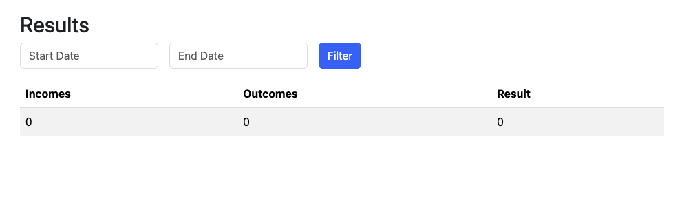

# Finnon API

## Introdução
Finnon é uma API desenvolvida para facilitar o gerenciamento de entradas (incomes) e saídas (outcomes) financeiras. Este sistema é ideal para usuários que desejam ter um controle detalhado de suas finanças pessoais ou empresariais.

## Tecnologias Utilizadas
- Go

## Funcionalidades
- Cadastrar, listar e gerenciar receitas e despesas.
- Filtragem de transações por fonte, tipo, data, entre outros.

## Começando

Para iniciar o projeto localmente, siga os passos abaixo:

### Pré-requisitos

- Go 1.21

Além disso, é bom ter um editor para trabalhar com o código, como [VSCode](https://code.visualstudio.com/).

### Instalação

1. Clone o repositório
```bash
git clone https://github.com/tonnytg/finnon.git
cd finnon
```


#### Demo


